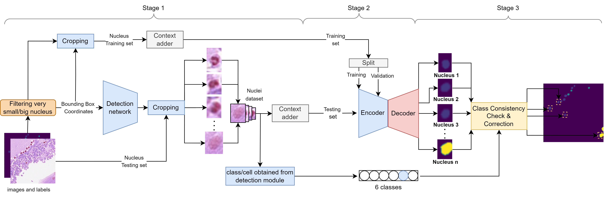

# MDSN

**MDSN** (Multi-stage Detection-Segmentation Network) is a modular three-stage segmentation architecture to simplify the complex nuclei segmentation task and tackle each challenge individually.

  

## Code will be available soon.